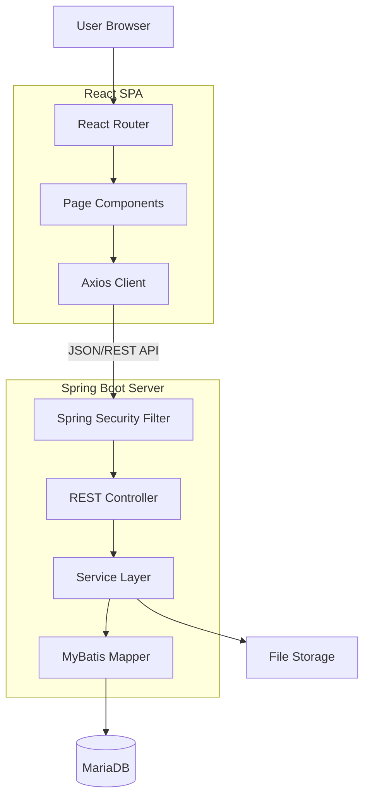

# nu-CMS 시스템 구조 및 작동 원리 (System Architecture & Principles)

## 1. 아키텍처 개요 (Architecture Overview)

**nu-CMS**는 보안성과 확장성을 고려하여 **Frontend(React)**와 **Backend(Spring Boot)**가 분리된 **Headless CMS** 지향 아키텍처를 채택하고 있습니다. 그러나 관리 편의성을 위해 단일 배포가 가능한 하이브리드 구조를 지원합니다.

### 1.1 전체 구조도

---

## 2. 작동 원리 (Operating Principles)

### 2.1 요청 처리 흐름 (Request Lifecycle)
사용자가 CMS에서 "저장" 버튼을 클릭했을 때의 데이터 흐름은 다음과 같습니다.

1.  **Frontend (Event)**: 사용자가 React 컴포넌트(Form)에서 데이터를 입력하고 저장 버튼을 클릭합니다.
2.  **API Client**: `Axios` 라이브러리가 백엔드 API (`/api/cms/...`)로 **JSON** 데이터를 비동기 전송합니다.
    *   *예시*: `POST /api/cms/board/1/post`
3.  **Security Filter**: Spring Security가 요청을 가로채 **JWT** 또는 **Session**을 검증합니다.
    *   인증되지 않은 요청은 `401 Unauthorized`를 반환합니다.
    *   권한이 부족한 요청(예: 일반 사용자가 설정 변경 시도)은 `403 Forbidden`을 반환합니다.
4.  **Controller**: 요청이 유효하면 해당 URL에 매핑된 `Controller` 메서드가 실행됩니다. 입력값 유효성 검사(`@Valid`)가 수행됩니다.
5.  **Service**: 비즈니스 로직이 실행됩니다. (예: 트랜잭션 시작, 데이터 가공, 파일 저장 등)
6.  **Persistence**: `MyBatis`가 실행되어 SQL이 DB로 전송됩니다.
7.  **Response**: 처리 결과가 DTO(Data Transfer Object)로 변환되어 JSON 형태로 프론트엔드에 반환됩니다.

### 2.2 인증 및 보안 (Authentication & Security)
*   **세션/토큰 하이브리드**: 관리자 페이지는 보안 강화를 위해 세션 기반 인증을 기본으로 사용하되, API 호출 시 CSRF 토큰 및 세션 쿠키를 함께 검증합니다.
*   **RBAC (Role-Based Access Control)**: `CMS_MEMBER_ROLE` (사용자-역할) 및 `CMS_MENU_ROLE` (역할-메뉴) 테이블을 통해 사용자에게 역할을 부여하고, 역할별로 접근 가능한 메뉴를 제어합니다. 서버 설정(`SecurityConfig.java`)과 프론트엔드 동적 라우팅이 이를 기반으로 작동합니다.

---

## 3. 상세 시스템 구조 (Detailed Structure)

### 3.1 Frontend (React + Vite)
사용자 인터페이스를 담당하는 계층입니다.
*   **`src/api/`**: 백엔드 통신을 위한 Axios 인스턴스 및 서비스 모듈이 정의되어 있습니다. (예: `cms.js`)
*   **`src/pages/`**: 라우트에 매핑되는 페이지 단위 컴포넌트입니다.
    *   *구조 패턴*: 목록(`List`) -> 상세/수정(`Form` or `Detail`)
*   **`src/layouts/`**: `MainLayout`(좌측 메뉴+헤더)과 `PublicLayout`(로그인/공개페이지)으로 구분됩니다.

### 3.2 Backend (Spring Boot + EgovFrame)
핵심 비즈니스 로직과 데이터를 처리합니다.
*   **Controller (`web` 패키지)**: HTTP 요청을 핸들링하는 진입점입니다. JSON 응답을 위해 `@RestController`를 사용합니다.
*   **Service (`service` 패키지)**: 트랜잭션 단위의 업무 로직인 인터페이스와 구현체(`impl`)로 나뉩니다. 전자정부 프레임워크 표준인 `EgovAbstractServiceImpl`을 상속받을 수 있습니다.
*   **Mapper (`mapper` 패키지)**: SQL 쿼리와 Java 객체를 매핑하는 인터페이스입니다. `src/main/resources/mapper` 경로의 XML 파일과 1:1로 매핑됩니다.

### 3.3 데이터베이스 (MariaDB)
정보를 영구 저장하는 관계형 데이터베이스입니다.
*   주요 테이블 접두사:
    *   `CMS_`: 시스템 고유 테이블 (회원, 메뉴, 로그 등)
    *   `COMTN`: 공통 컴포넌트 테이블 (파일, 코드 등 - 전자정부 표준)

---

## 4. 핵심 모듈 설명 (Key Modules)

### 4.1 워크플로우 엔진 (Workflow Engine)
콘텐츠의 생명주기(작성 -> 승인대기 -> 게시)를 관리합니다.
*   **상태 머신**: 콘텐츠는 `DRAFT`, `PENDING`, `PUBLISHED`, `REJECTED` 상태를 가집니다.
*   **스냅샷**: 승인 요청 시점의 데이터를 `CMS_WORKFLOW_REQUEST` 테이블에 JSON 형태로 스냅샷(Snapshot) 저장하여, 원본이 수정되더라도 승인 요청 당시의 내용을 보존합니다.

### 4.2 DAM (Digital Asset Management)
파일 업로드 및 관리를 담당합니다.
*   **물리적 저장**: 파일은 서버의 로컬 파일 시스템(또는 설정된 경로)에 저장됩니다.
*   **논리적 참조**: DB에는 파일 경로(`STRE_FILE_NM`)와 원본 파일명(`ORIGNL_FILE_NM`)이 매핑되어 관리됩니다. 사용자는 `ATCH_FILE_ID`만으로 파일에 접근합니다.

### 4.3 동적 메뉴 시스템
*   `CMS_MENU` 테이블의 계층 구조 정보를 기반으로, React 프론트엔드가 시작될 때 동적으로 사이드바 메뉴(`Sidebar.jsx`)를 렌더링합니다. 이를 통해 소스코드 수정 없이 관리자 화면에서 메뉴 구조를 변경할 수 있습니다.
